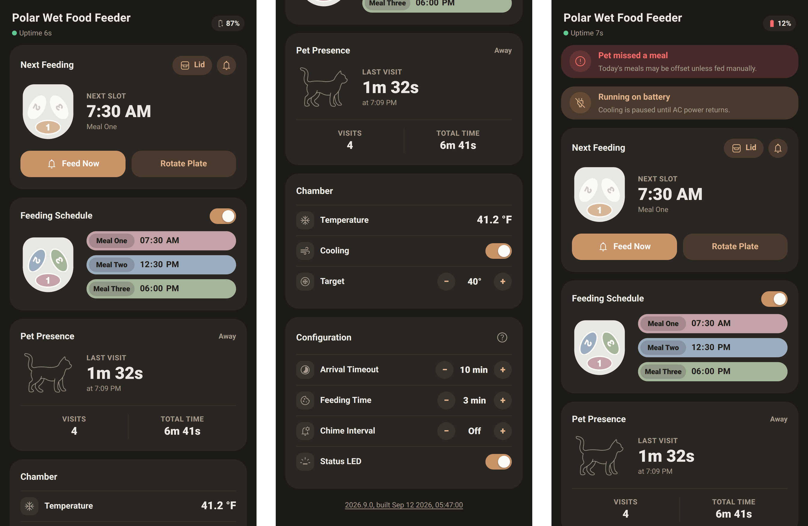

# On-Device ESPHome Web Control for PetLibro PLAF109

A mobile-first remote for the [PetLibro PLAF109](https://github.com/sylphrena0/petlibro-esphome/tree/main/plaf109) (Polar Wet Food Feeder) running ESPHome. Serve from the device with [esphome-custom-web-server](https://github.com/sylphrena0/esphome-custom-web-server). Controls are implemented through ESPHome's `web_server` API (`/events` and the REST endpoints).

This is a ESPHome only solution to take control of your PetLibro Wet Feeder without need for a HAOS server and with UX better than the factory app (IMO). You might be better off with a dashboard in HAOS if you have that available. Don't port forward this application without SSL and authentication.



Fig 1. screenshots of various pages using mocked data (this feeder doesn't seem to get that cold).

## Usage

```yaml
web_server:
  version: 3

custom_web_server:
  - path: /ui
    title: Polar Wet Food Feeder
    js_url: https://github.com/sylphrena0/petlibro-esphome-plaf109-ui/releases/latest/download/app.js
    css_url: https://github.com/sylphrena0/petlibro-esphome-plaf109-ui/releases/latest/download/style.css
    body: <esp-app></esp-app>
    local: true
```

The UI looks entities up by name, so the names in [src/entities.ts](src/entities.ts) have to match the firmware config.

## Development

Requires Node 24 and Yarn (`corepack enable`).

```sh
yarn install
yarn dev # build, then serve a mock feeder at http://localhost:8081
yarn build # build/app.js and build/style.css
yarn lint
```

`yarn dev` runs [dev-server.mjs](dev-server.mjs), which mocks the ESPHome `/events` stream and REST endpoints so you can work on the UI without a device.
